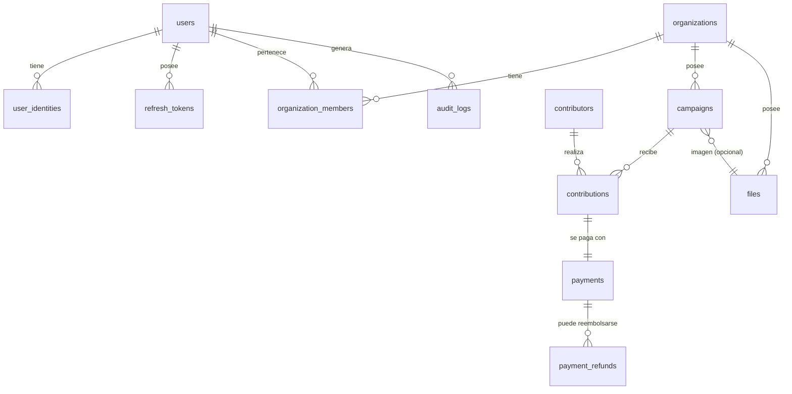

# Juntalo — Etapa 3: Modelo entidad-relación

> Estado: **propuesta, pendiente de aprobación**. Depende de Etapa 1 y Etapa 2 (Go + sqlc + Postgres, split payment) aprobadas. Este documento define tablas, columnas, constraints e índices; será la fuente de la migración `0001_init.sql` en la Etapa 7.

---

## 1. Diagrama general



Convenciones globales:
- **PKs**: `uuid` generadas por la app (`uuidv7` — ordenables por tiempo, mejor localidad de índice que v4).
- **Timestamps**: `created_at`/`updated_at` `timestamptz NOT NULL DEFAULT now()` en todas las tablas; `deleted_at` solo donde el soft-delete tiene sentido de negocio (campañas). No se hace soft-delete genérico.
- **Dinero**: `bigint` en CLP (enteros, sin decimales — Etapa 1, riesgo 9) + `currency char(3) NOT NULL DEFAULT 'CLP'` con `CHECK (currency = 'CLP')` que se relaja al ir multi-moneda.
- **Enums**: tipos `text` + `CHECK` constraint (no `CREATE TYPE enum`: alterar enums de Postgres en migraciones es doloroso; el CHECK se reemplaza barato).

---

## 2. Identidad y tenancy

### `users`
| Columna | Tipo | Notas |
|---|---|---|
| id | uuid PK | |
| email | citext UNIQUE NOT NULL | `citext` para unicidad case-insensitive |
| email_verified_at | timestamptz NULL | verificación fuera del MVP, columna lista |
| full_name | text NOT NULL | |
| status | text NOT NULL DEFAULT 'active' | CHECK: `active/blocked` |
| created_at / updated_at | timestamptz | |

### `user_identities` — credenciales separadas del usuario (Etapa 2 §2.5)
| Columna | Tipo | Notas |
|---|---|---|
| id | uuid PK | |
| user_id | uuid FK→users NOT NULL | ON DELETE CASCADE |
| provider | text NOT NULL | CHECK: `password/google` (google reservado) |
| password_hash | text NULL | argon2id; NULL para proveedores OAuth |
| provider_subject | text NULL | `sub` de OAuth; NULL para password |
| UNIQUE(user_id, provider) · UNIQUE(provider, provider_subject) | | un método por proveedor; un sub OAuth no puede pertenecer a dos users |

### `refresh_tokens`
| Columna | Tipo | Notas |
|---|---|---|
| id | uuid PK | |
| user_id | uuid FK→users NOT NULL | ON DELETE CASCADE |
| token_hash | text UNIQUE NOT NULL | se guarda hash (sha256), nunca el token |
| expires_at | timestamptz NOT NULL | |
| revoked_at | timestamptz NULL | rotación: al usarse se revoca y emite uno nuevo |
| created_at | timestamptz | índice en `(user_id)` para revocación masiva en logout-all |

### `organizations` — tenant desde el día 1 (Etapa 1, riesgo 4)
| Columna | Tipo | Notas |
|---|---|---|
| id | uuid PK | |
| name | text NOT NULL | en MVP = nombre del usuario ("org personal") |
| kind | text NOT NULL DEFAULT 'personal' | CHECK: `personal/team` (team futuro) |
| commission_rate | numeric(5,4) NOT NULL | tarifa vigente de la org (p.ej. `0.0500`); **snapshot al pagar, nunca se lee en caliente para históricos** |
| rut | text NULL | KYC-ready (Etapa 1 §0): NULL en MVP |
| payout_bank / payout_account_type / payout_account_number / payout_holder_name | text NULL | datos de liquidación split payment, NULL en MVP |
| created_at / updated_at | timestamptz | |

### `organization_members`
| Columna | Tipo | Notas |
|---|---|---|
| organization_id | uuid FK→organizations | PK compuesta (organization_id, user_id) |
| user_id | uuid FK→users | |
| role | text NOT NULL DEFAULT 'owner' | CHECK: `owner/admin/viewer` — en MVP siempre `owner`; la tabla existe para que multi-admin sea un INSERT, no una migración |
| created_at | timestamptz | |

Al registrarse un usuario se crean, en la misma transacción: `users` + `user_identities(password)` + `organizations(personal)` + `organization_members(owner)`.

---

## 3. Campañas

### `campaigns`
| Columna | Tipo | Notas |
|---|---|---|
| id | uuid PK | |
| organization_id | uuid FK→organizations NOT NULL | dueño real (no el user) |
| type_key | text NOT NULL | CHECK: `collection/sale/event/course/presale/raffle` — el registro de tipos vive en código (Etapa 1, riesgo 1); la DB solo persiste la key |
| title | text NOT NULL | CHECK largo ≤ 120 |
| slug | text UNIQUE NOT NULL | generado + validado; índice implícito por UNIQUE |
| description | text NOT NULL DEFAULT '' | |
| cover_file_id | uuid FK→files NULL | imagen **opcional** (riesgo 11) |
| goal_amount | bigint NULL | meta económica; NULL = sin meta (el tipo decide si es requerida) |
| currency | char(3) NOT NULL DEFAULT 'CLP' | CHECK 'CLP' |
| status | text NOT NULL DEFAULT 'draft' | CHECK: `draft/active/paused/finished/suspended` (riesgo 13) |
| starts_at / ends_at | timestamptz NULL | "expirada" se deriva de `ends_at`, no es estado |
| settings | jsonb NOT NULL DEFAULT '{}' | atributos específicos del tipo (registro declarativo) |
| deleted_at | timestamptz NULL | soft-delete: una campaña con pagos jamás se borra físicamente |
| created_at / updated_at | timestamptz | |

Índices: `UNIQUE(slug)` · `(organization_id, status)` para el dashboard · parcial `(status) WHERE status='active'` para listados públicos futuros.

**El monto recaudado NO es una columna** (riesgo 12): es `SUM` sobre pagos confirmados menos reembolsos (ver §5). Vista `campaign_totals` para no repetir la query.

---

## 4. Contribuyentes y aportes

Separación deliberada **contribution ≠ payment**: la contribución es el hecho de negocio ("Juan aportó a la campaña X, anónimo, con mensaje"); el pago es la transacción financiera que la respalda. En el MVP la relación es 1:1, pero la separación permite después: aportes con múltiples ítems (tipo "venta"), reintentos de pago sobre la misma contribución, y aportes sin dinero (inscripciones gratuitas a eventos).

### `contributors` — persona que aporta, SIN cuenta (Etapa 1, riesgo 7)
| Columna | Tipo | Notas |
|---|---|---|
| id | uuid PK | |
| full_name | text NOT NULL | |
| email | citext NULL | contacto opcional |
| phone | text NULL | contacto opcional |
| created_at | timestamptz | |

Sin UNIQUE en email: la misma persona puede aportar dos veces con datos distintos; deduplicar es un problema de reporting futuro, no un constraint que bloquee aportes. Índice no-único en `(email)` para búsquedas.

### `contributions`
| Columna | Tipo | Notas |
|---|---|---|
| id | uuid PK | |
| campaign_id | uuid FK→campaigns NOT NULL | |
| contributor_id | uuid FK→contributors NOT NULL | |
| amount | bigint NOT NULL | CHECK > 0 |
| currency | char(3) DEFAULT 'CLP' | |
| is_anonymous | boolean NOT NULL DEFAULT false | oculta el nombre en público; cuenta en totales (riesgo 15) |
| message | text NULL | preparado para mostrarse en la página pública |
| status | text NOT NULL DEFAULT 'pending' | CHECK: `pending/confirmed/failed/refunded` — **derivado del pago**, denormalizado aquí solo como cache de lectura para la página pública; la transición ocurre en la misma tx que la del pago |
| created_at / updated_at | timestamptz | |

Índices: `(campaign_id, status, created_at DESC)` — la query de la página pública ("últimos participantes confirmados") y la del dashboard salen de este índice.

---

## 5. Pagos (núcleo financiero)

### `payments`
| Columna | Tipo | Notas |
|---|---|---|
| id | uuid PK | |
| contribution_id | uuid FK→contributions UNIQUE NOT NULL | 1:1 en MVP; si mañana hay reintentos, se quita el UNIQUE (barato) |
| idempotency_key | text UNIQUE NOT NULL | riesgo 8: generada por el cliente al iniciar el flujo; el UNIQUE es la garantía final contra doble cargo |
| provider | text NOT NULL | CHECK: `mock/webpay/mercadopago/stripe/khipu` |
| provider_ref | text NULL | id del intent en la pasarela; UNIQUE parcial `WHERE provider_ref IS NOT NULL` |
| status | text NOT NULL DEFAULT 'pending' | CHECK: `pending/confirmed/failed/refunded/partially_refunded` |
| amount_gross | bigint NOT NULL | lo que pagó el contribuyente |
| commission_rate_applied | numeric(5,4) NOT NULL | **snapshot** de la tarifa al momento del pago (riesgo 3) |
| commission_amount | bigint NOT NULL | CHECK: `commission_amount = ROUND(amount_gross * rate)` se valida en app, no en CHECK (redondeo) |
| amount_net | bigint NOT NULL | CHECK: `amount_net = amount_gross - commission_amount` |
| currency | char(3) DEFAULT 'CLP' | |
| payee_snapshot | jsonb NOT NULL | a qué cuenta del organizador se dirigió el split (snapshot, no FK a columnas mutables) |
| confirmed_at / failed_at | timestamptz NULL | |
| created_at / updated_at | timestamptz | |

Índices: `UNIQUE(idempotency_key)` · `UNIQUE(provider, provider_ref) WHERE provider_ref IS NOT NULL` · `(status, created_at)` para conciliación.

**Máquina de estados (en dominio, la DB solo persiste):**
```
pending ── confirmed ── partially_refunded ── refunded
   └────── failed
```
Transiciones válidas codificadas en `domain/payment`; cualquier otra es error de dominio. `refunded` es terminal.

### `payment_refunds` — reembolsos como filas, no como flags (riesgo 10)
| Columna | Tipo | Notas |
|---|---|---|
| id | uuid PK | |
| payment_id | uuid FK→payments NOT NULL | |
| amount | bigint NOT NULL | CHECK > 0; permite reembolsos parciales |
| provider_ref | text NULL | id del refund en la pasarela |
| reason | text NULL | |
| created_at | timestamptz | |

La app garantiza `SUM(refunds.amount) <= payment.amount_gross` con `SELECT ... FOR UPDATE` sobre el payment.

### Vista `campaign_totals` (el "monto recaudado" correcto por construcción)
```sql
CREATE VIEW campaign_totals AS
SELECT
  c.id AS campaign_id,
  COALESCE(SUM(p.amount_gross) FILTER (WHERE p.status IN ('confirmed','partially_refunded')), 0)
    - COALESCE(SUM(r.refunded), 0)                       AS raised_gross,
  COALESCE(SUM(p.amount_net)  FILTER (WHERE p.status IN ('confirmed','partially_refunded')), 0)
    - COALESCE(SUM(r.refunded), 0)                       AS raised_net_approx,
  COUNT(DISTINCT ct.id) FILTER (WHERE ct.status = 'confirmed') AS contributor_count
FROM campaigns c
LEFT JOIN contributions ct ON ct.campaign_id = c.id
LEFT JOIN payments p       ON p.contribution_id = ct.id
LEFT JOIN LATERAL (SELECT SUM(amount) AS refunded FROM payment_refunds WHERE payment_id = p.id) r ON true
GROUP BY c.id;
```
(La query final se afinará en implementación — lo importante es la decisión: **agregación, no contador**. Si algún día un `campaign_totals` en vivo es lento, el camino es una materialized view o el contador transaccional descrito en riesgo 12 — ambos sin tocar el schema.)

---

## 6. Archivos y auditoría

### `files`
| Columna | Tipo | Notas |
|---|---|---|
| id | uuid PK | |
| organization_id | uuid FK→organizations NOT NULL | dueño del archivo (cuota futura por org) |
| kind | text NOT NULL | CHECK: `campaign_cover` (más kinds después: gallery, avatar...) |
| storage_key | text NOT NULL | ruta en el backend de storage (local hoy, R2 mañana — la URL pública se deriva, no se persiste) |
| mime_type | text NOT NULL | validado contra allowlist (image/jpeg, png, webp) |
| size_bytes | bigint NOT NULL | CHECK ≤ 5MB en app |
| created_at | timestamptz | |

### `audit_logs` — append-only
| Columna | Tipo | Notas |
|---|---|---|
| id | uuid PK | |
| actor_user_id | uuid FK→users NULL | NULL = sistema |
| organization_id | uuid NULL | para filtrar por tenant |
| action | text NOT NULL | `campaign.published`, `campaign.suspended`, `payment.refunded`, ... |
| entity_type / entity_id | text / uuid NOT NULL | |
| data | jsonb NOT NULL DEFAULT '{}' | diff o contexto relevante |
| created_at | timestamptz | índice `(organization_id, created_at DESC)`; **sin** updated_at: nunca se actualiza |

---

## 7. Decisiones transversales y por qué

| Decisión | Justificación | Alternativa descartada |
|---|---|---|
| `contribution` ≠ `payment` | El hecho de negocio y la transacción financiera evolucionan distinto (reintentos, multi-ítem, aportes gratis) | Una sola tabla: se vuelve God-table al agregar tipos de campaña |
| Reembolsos como tabla | Parciales + trazabilidad + reporting que resta correcto | Flag/columna en payment: pierde historial y parciales |
| Monto recaudado = vista | Correcto por construcción, sin carreras (riesgo 12) | Contador denormalizado: bug clásico; se puede agregar después con datos |
| text+CHECK, no enum nativo | Alterar enums en Postgres requiere migraciones incómodas | `CREATE TYPE`: rígido sin beneficio real |
| uuidv7 | Ordenable por tiempo → índices B-tree sanos, paginación estable | v4: fragmentación de índice; serial: expone volumen de negocio en URLs |
| `citext` para emails | Unicidad case-insensitive sin normalizar en app | lower() por convención: se olvida una vez y hay duplicados |
| Snapshot `payee_snapshot` jsonb | Los datos bancarios de la org mutan; el pago debe registrar a dónde fue el dinero *ese día* | FK a columnas mutables: reescribe la historia |
| Sin tabla `campaign_types` | El registro vive en código (Etapa 1, riesgo 1); una tabla espejo se desincroniza | Tabla + seeds: burocracia sin query que la necesite |

---

## Siguiente paso

Aprobado este modelo, la **Etapa 4** define los endpoints REST (rutas, verbos, request/response, códigos de error) sobre estas entidades.
